<a id="top"></a>

<p align="center">
  
</p>

<p align="center">
  <a href="https://github.com/DevL0rd/DotBot/actions/workflows/complexity.yml"></a>
  
  
  <a href="LICENSE"></a>
</p>

<h3 align="center">Your Discord bot, within reach of dot.</h3>

<p align="center">
  DotBot gives an authenticated MCP client 87 typed tools for a real Discord bot.<br>
  Whitelisted people address it. Your connected dot polls requests or explicitly subscribes through a supported ChatGPT host.
</p>

<p align="center">
  <a href="#get-started"><b>Get started</b></a> ·
  <a href="#capabilities"><b>Capabilities</b></a> ·
  <a href="#authorization"><b>Who can use it</b></a> ·
  <a href="#connection"><b>Connect dot</b></a> ·
  <a href="#questions"><b>Questions</b></a>
</p>

---

<a id="get-started"></a>

## 🚀 Get started

Requires Node.js **22.16 or newer** and npm. The server is portable across Linux, macOS and Windows; local validation was performed on Linux. There are no system installers, background services or application screens.

```sh
git clone https://github.com/DevL0rd/DotBot.git
cd DotBot
npm ci --ignore-scripts
npm run build
```

Before running, create `.env` from [.env.example](.env.example). For a fresh checkout, create `policy.json` from [policy.example.json](policy.example.json); **keep an existing local policy**. Use `cp` on Linux/macOS or `Copy-Item` in PowerShell. Set credentials locally, never in a chat, repository or connection URL. The example credentials cannot start the server.

The public policy deliberately allows **zero people, zero scopes and zero destinations**. User IDs must be quoted JSON strings. Choose your capabilities and either list guild/channel IDs or explicitly use:

```json
{
  "guildScope": "all",
  "channelScope": "all"
}
```

These are fields to merge into the full policy. They include every accessible joined guild/channel/thread, including future ones. They do not relax the user whitelist, trigger requirement, capability scopes or proactive destination grants.

**Name detection needs both intent switches:** in the [Discord Developer Portal](https://discord.com/developers/applications), open your application → **Bot → Privileged Gateway Intents → Message Content Intent**, enable it and save; set `DOTBOT_MESSAGE_CONTENT=true` in `.env` and `triggers.matchNames=true` in the policy. Restart DotBot after changing either file. If Discord requires privileged-intent approval for your app, obtain it before enabling the Gateway intent. DotBot fails configuration validation when name matching is enabled without its local intent switch. [Discord’s intent reference](https://docs.discord.com/developers/events/gateway#privileged-intents) describes the platform requirements.

After you have separately prepared the bot, credentials and installation:

```sh
npm start
```

This runs in the foreground and connects to Discord. Ctrl+C stops it. The MCP endpoint binds only to `http://127.0.0.1:8787/mcp` and requires authentication. Nothing in the project installs or starts a durable service.

| Setting | What it controls |
| :-- | :-- |
| `allowedUserIds` | Sole Discord requester whitelist; empty denies every requester |
| `guildScope`, `channelScope` | `listed` by default, or explicit `all` |
| `scopes` | Explicit API capabilities; independent of Discord permissions |
| `triggers` | Explicit mention, bounded name/alias matching, or verified reply to this bot |
| `context` | Optional bounded recent-message index; observation never authorizes responses |
| `mcpEvents` | Optional verified durable webhook subscriptions; all-message delivery is separately opt-in |
| `media` | Optional bounded attachment index and file-size controls; capture never authorizes a response |
| `proactive` | Individually approved send destinations; empty disables proactive sends |
| `DOTBOT_GUILD_MEMBERS` | Optional Server Members intent for member listing; disabled by default |
| `DOTBOT_AUTH_MODE` | Local bearer credential or external OAuth JWT resource validation |

See [setup and permissions](docs/setup.md) for full configuration, Administrator installation guidance and shutdown/recovery details.

---

<a id="capabilities"></a>

## 🧰 What dot can do

The bridge exposes 70 Discord operations, six bridge/discovery tools, three bounded context tools, seven media tools and one correlated interaction tool. Each has a bounded input schema. Discord operations also require an explicit capability scope. Discord remains the authority for permissions, hierarchy, resource types and API limits.

| Area | Implemented capabilities |
| :-- | :-- |
| Context & delivery | Recent channel/thread context, same-user cross-channel context, retained-text search; explicit polls and MCP 2.0 verified webhook subscriptions |
| Conversations | Captured-event replies, ephemeral `/dot` responses, DM the originating user, controlled proactive sends |
| Files & images | Safe bounded file/image/GIF uploads, verified source links, latest/specific/multiple attachment lookup and chunked retrieval for client-side editing |
| Interactive requests | Actor-bound single-use buttons, string selects, modal launch/custom input; correlated child events with live parent checks |
| Messages | History, individual messages, pins, bot-message edits, confirmed deletion/bulk deletion, reactions |
| Polls | Create, end bot-authored polls, read voters |
| Channels & threads | Inspect/create/edit/delete channels; permission overwrites; active/archived threads; forum posts; archive/lock; thread membership |
| Members & moderation | Member metadata/listing, nicknames, timeouts, kicks, bans/unbans, ban listing |
| Roles & voice state | Role metadata, create/edit/delete/reorder; assign/remove; move/disconnect/mute/deafen members |
| Server administration | Guild metadata/settings, audit log, bounded invites and revocation, guild command registration/deletion |
| Events & expressions | External scheduled events, emoji creation/renaming/deletion, sticker metadata/edit/delete |
| AutoMod | List rules, create keyword-block rules, enable/disable/delete rules |

[The capability reference](docs/capabilities.md) lists every tool, its scope, prerequisites and coverage gaps. There is no arbitrary REST tool, shell executor, code evaluator, selfbot, embedded model or UI.

---

<a id="authorization"></a>

## 🔐 Who can use it

**Whitelist first, trigger second.** Unlisted users are rejected before trigger text, command options or reply references are examined. An allowed user must mention the bot directly in message text, use a configured name/alias, or reply to a fetched message verified to be authored by this bot in the same channel. Missing, deleted or mismatched references fail closed. `triggers.replyToBot` controls that last option. `DOT, help` matches `dot`; `anecdotal`, `dotnet`, `dot2` and `_dot_` do not. Boundaries account for Unicode letters/numbers and underscores. Literal occurrences inside quotes/code count; this is text matching, not intent inference. Unaddressed DMs and ordinary conversation stay quiet. Bots, webhooks, reactions, edits and unrelated commands never create requests. Optional all-message observations may index non-whitelisted guild users or deliver their data to an opted-in subscriber; they never receive an actionable trigger ID or authorize a response.

An explicit invocation of this bot’s `/dot` command also counts as addressing it. Only allowed users in approved origins get an ephemeral deferred response. Every user-driven write needs an unexpired captured `eventId`; MCP callers cannot supply an actor ID or forge an origin. The same checks cover replies, DMs, interactions, threads, message edits, reactions and indirect actions. Outbound mentions are disabled, and DMs can only target the originating whitelisted person.

Verified controls from the bot's own prompt can produce a correlated child request only for the originating allowed user. The actual prompt message, application, channel and live parent must match. Modal input and button selections never approve sensitive actions. [Files and controls](docs/media-and-controls.md) explains the bounds, client editing handoff and source checks.

Content-producing channel tools stay in the originating channel/thread. Guild administration stays in the originating guild. Destructive and permission-changing tools return an exact preview and a two-minute approval ID; the same user must explicitly approve it through a new addressed Discord message or `/dot` invocation in the same channel. The MCP client then repeats the original operation with that approval ID. Model-supplied confirmation cannot replace this step.

Proactive sends use a separate tool and explicit per-channel grants; `all` scope never enables them automatically. They cannot DM arbitrary people. A channel reply remains visible to other members who can see that channel: the requester whitelist is not an audience privacy boundary. Moderation may target unlisted members after confirmation, but sends them no automatic notification.

---

<a id="connection"></a>

## 🔌 Connect dot

Local MCP clients can use Streamable HTTP with an `Authorization: Bearer …` header. ChatGPT needs a reachable endpoint or a supported secure tunnel; entering a laptop’s loopback URL in a remote client does not make the laptop reachable. For ChatGPT, DotBot includes protected-resource discovery and validation for a separately configured OAuth provider. A static bearer credential is intended for local clients that support custom headers, and is not advertised as ChatGPT OAuth.

Follow [connection and handoff](docs/connection.md) for the authentication contract, private-tunnel/reverse-proxy requirements, and the polling instructions to give dot. [Events and context](docs/mcp-events.md) covers modern discovery, verified callbacks, durable owners/filters/expiration, signatures, SSRF controls and bounded context. No tunnel, OAuth provider, app connection or credential is configured by installing this repository. See [OpenAI authentication](https://developers.openai.com/plugins/build/auth) and [Secure MCP Tunnel](https://developers.openai.com/api/docs/guides/secure-mcp-tunnels) for the current host requirements and availability.

**Arbitrary Discord events do not automatically wake this ChatGPT conversation.** Explicit polling remains available. The [official MCP Events integration](https://developers.openai.com/plugins/build/mcp-events) also supports delivery to an explicitly subscribed chat through a compatible host/plugin; it requires separate connection and user setup. No subscription or connection has been configured by this build.

---

<a id="questions"></a>

## 💬 Questions

<details>
<summary><b>Can I grant Administrator later?</b></summary>

Yes. [discord-app.example.json](discord-app.example.json) records a guild installation with `bot`, `applications.commands` and permission value `8` (Administrator). [Setup](docs/setup.md) explains the later manual installation. This repository does not generate an invite or grant privileges. Administrator bypasses channel overwrites; it does not bypass role hierarchy, ownership, privileged intents, bot/API restrictions or Discord policy. [Discord permissions](https://docs.discord.com/developers/topics/permissions) define those boundaries.

</details>

<details>
<summary><b>Is delivery exactly once?</b></summary>

No. DotBot serializes mutations and persists hashed idempotency keys before the request. Successful outcomes can be replayed for 24 hours; pending/uncertain outcomes block automatic replay. Discord nonces add short-lived protection for text sends. A crash or network failure can leave an unknown outcome. Inspect Discord before issuing another key; see [architecture and recovery](docs/architecture.md).

</details>

<details>
<summary><b>How is it checked?</b></summary>

Run `npm run check`, `npm run build`, `npm run validate` and `npm run complexity`. Validation uses in-process Discord mocks and a temporary authenticated loopback MCP server, then cleans up. It does not log in to Discord. GitHub Actions runs only code-complexity checking; there are no deployment, integration-test or credential jobs. [Validation details](docs/validation.md) record the practical limits.

</details>

---

<a id="more"></a>

## 🧰 More from DevL0rd

Other Plasma projects made to sit on the same desktop. Click a banner to open it on GitHub.

<p align="center">
  <a href="https://github.com/DevL0rd/Konveyor">
    <picture>
      <source media="(prefers-color-scheme: dark)" srcset="https://raw.githubusercontent.com/DevL0rd/Konveyor/main/docs/media/banner-dark.svg">
      <source media="(prefers-color-scheme: light)" srcset="https://raw.githubusercontent.com/DevL0rd/Konveyor/main/docs/media/banner-light.svg">
      
    </picture>
  </a>
  <br>
  <a href="https://github.com/DevL0rd/Konveyor"><b>Konveyor</b></a> · Your windows, on a conveyor belt.
</p>

<p align="center">
  <a href="https://github.com/DevL0rd/RVC-Voice-Changer">
    <picture>
      <source media="(prefers-color-scheme: dark)" srcset="https://raw.githubusercontent.com/DevL0rd/Konveyor/main/docs/media/more/rvc-voice-changer-dark.svg">
      <source media="(prefers-color-scheme: light)" srcset="https://raw.githubusercontent.com/DevL0rd/Konveyor/main/docs/media/more/rvc-voice-changer-light.svg">
      
    </picture>
  </a>
  <br>
  <a href="https://github.com/DevL0rd/RVC-Voice-Changer"><b>RVC Voice Changer</b></a> · Sound like anyone, in every app.
</p>

<p align="center">
  <a href="https://github.com/DevL0rd/KBoard">
    <picture>
      <source media="(prefers-color-scheme: dark)" srcset="https://raw.githubusercontent.com/DevL0rd/Konveyor/main/docs/media/more/kboard-dark.svg">
      <source media="(prefers-color-scheme: light)" srcset="https://raw.githubusercontent.com/DevL0rd/Konveyor/main/docs/media/more/kboard-light.svg">
      
    </picture>
  </a>
  <br>
  <a href="https://github.com/DevL0rd/KBoard"><b>KBoard</b></a> · Type, glide and talk, right on your desktop.
</p>

<p align="center">
  <a href="https://github.com/DevL0rd/Android-Daemon">
    <picture>
      <source media="(prefers-color-scheme: dark)" srcset="https://raw.githubusercontent.com/DevL0rd/Konveyor/main/docs/media/more/android-daemon-dark.svg">
      <source media="(prefers-color-scheme: light)" srcset="https://raw.githubusercontent.com/DevL0rd/Konveyor/main/docs/media/more/android-daemon-light.svg">
      
    </picture>
  </a>
  <br>
  <a href="https://github.com/DevL0rd/Android-Daemon"><b>Android-Daemon</b></a> · Your phone, right on your desktop.
</p>

<p align="center">
  <a href="https://github.com/DevL0rd/Syncthing-Monitor">
    <picture>
      <source media="(prefers-color-scheme: dark)" srcset="https://raw.githubusercontent.com/DevL0rd/Konveyor/main/docs/media/more/syncthing-monitor-dark.svg">
      <source media="(prefers-color-scheme: light)" srcset="https://raw.githubusercontent.com/DevL0rd/Konveyor/main/docs/media/more/syncthing-monitor-light.svg">
      
    </picture>
  </a>
  <br>
  <a href="https://github.com/DevL0rd/Syncthing-Monitor"><b>Syncthing Monitor</b></a> · Your sync, at a glance.
</p>


---

<p align="center">Released under the <a href="LICENSE">MIT license</a>.</p>
<p align="center"><a href="#top">Back to top ⬆</a></p>
