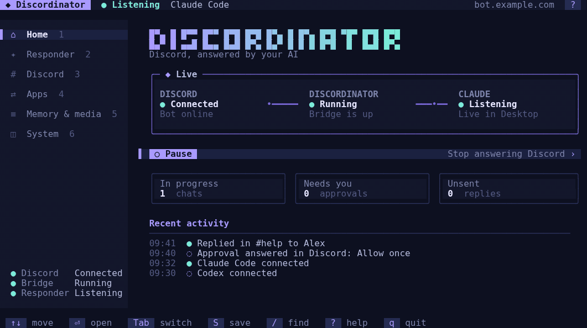
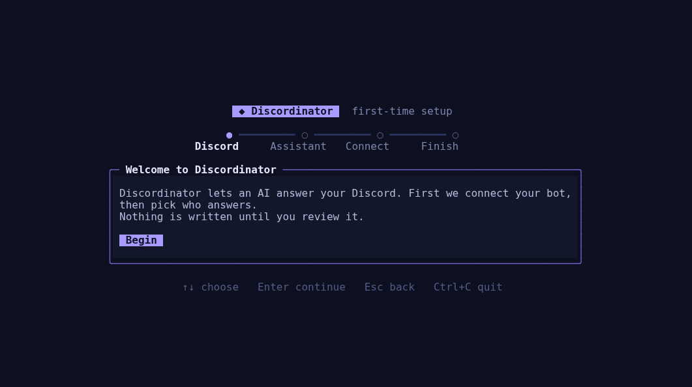

<a id="top"></a>

<p align="center">
  <picture>
    <source media="(prefers-color-scheme: dark)" srcset="docs/media/banner-dark.svg">
    <source media="(prefers-color-scheme: light)" srcset="docs/media/banner-light.svg">
    
  </picture>
</p>

<p align="center">
  <a href="https://github.com/DevL0rd/Discordinator/actions/workflows/quality.yml"></a>
  
  
  <a href="LICENSE"></a>
  <a href="https://github.com/DevL0rd/Discordinator/stargazers"></a>
</p>

<h3 align="center">Discord, answered by your AI.</h3>

<p align="center">
  Connect Claude, Codex, ChatGPT or any MCP app to your Discord server.<br>
  One of them answers new messages with full memory, every one of them can lend a hand,<br>
  and you decide exactly where they work and what they are allowed to do.
</p>

<p align="center">
  <a href="#get-started"><b>Get started</b></a> ·
  <a href="#see-it-work"><b>See it work</b></a> ·
  <a href="#who-answers"><b>Who answers</b></a> ·
  <a href="#apps"><b>Connected apps</b></a> ·
  <a href="#control"><b>Stay in control</b></a> ·
  <a href="#docs"><b>Docs</b></a> ·
  <a href="#more"><b>More projects</b></a>
</p>

<p align="center">
  
</p>

---

<a id="get-started"></a>

## 🚀 Get started

```sh
git clone https://github.com/DevL0rd/Discordinator.git discordinator
cd discordinator
npm ci --ignore-scripts
npm run setup
```

The setup app walks you through everything on first run: your Discord bot, who answers, and how it connects. Nothing is written until you review it.

<p align="center">
  
</p>

<table>
  <tr>
    <td>▶️ <b>Run it</b></td>
    <td><code>npm run build</code> then <code>npm start</code>, or install the background service from <b>System</b> so Discordinator starts when you log in.</td>
  </tr>
  <tr>
    <td>⚙️ <b>Change anything</b></td>
    <td><code>npm run setup</code> opens the setup app any time. Keyboard and mouse both work, and every change is reviewed before it is saved.</td>
  </tr>
  <tr>
    <td>🔄 <b>Update</b></td>
    <td><code>git pull</code>, <code>npm ci --ignore-scripts</code>, <code>npm run build</code>, then restart. Settings carry over, and older settings files are migrated automatically.</td>
  </tr>
  <tr>
    <td>🖥️ <b>Needs</b></td>
    <td>Node.js 22.16 or newer and a Discord bot. A public HTTPS domain is only needed for apps that connect from the cloud, like ChatGPT or Claude Desktop.</td>
  </tr>
</table>

<p align="right"><a href="#top">back to top ⬆</a></p>

---

<a id="see-it-work"></a>

## 🎬 See it work

### 🧠 One responder, full memory

Pick one AI to answer Discord. Mention the bot or reply to it, and the request lands in an ongoing conversation that remembers what came before, along with what was said in the channel since. It shows it is typing, posts each step as it works (with commands in code blocks), and answers in the same channel, thread or DM. When the conversation fills up, it warns you at 50% and 90%.

### 🤝 Every AI can help

Connect as many apps as you like. Only the primary responder receives new messages, so nobody answers twice, but every connected app can read Discord, post, and pick up tasks you hand it.

### 💬 Talks like a real member

Replies, files and images, reactions, threads, polls, buttons, menus and forms, with polished embeds for reports and results. Questions from the AI become Discord buttons or forms that only the person who asked can answer, and approvals arrive as a clear warning card. Images Codex generates are posted straight into the chat.

### ⚡ Slash commands

<code>/status</code> · <code>/usage</code> for Claude or Codex plan limits and context use · <code>/compact</code> · <code>/new</code> · <code>/stop</code> · <code>/activity</code> · <code>/responder</code> · <code>/model</code>. Every setting can also be changed by the AIs themselves over MCP.

### 🛠️ Helps run your server

Channels, threads, roles, members, moderation, scheduled events, AutoMod, invites, emoji and stickers — over 90 tools, each behind a capability you grant on purpose.

### 🖥️ A setup app you will actually enjoy

Live status for Discord, the bridge and your AI on one screen, with honest states: running, connected, listening, saved and active are never blurred together. Manage each server and its channels, pick people and roles from your members, search any setting with <kbd>/</kbd>, and save with <kbd>S</kbd>. Saved settings apply on their own.

<p align="right"><a href="#top">back to top ⬆</a></p>

---

<a id="who-answers"></a>

## 🧭 Who answers

<table>
  <tr>
    <th></th>
    <th align="left">How messages reach it</th>
    <th align="left">Memory</th>
  </tr>
  <tr>
    <td>✨ <b>Claude Code</b></td>
    <td>Messages are pushed live into your Discordinator conversation in Claude Desktop, which opens by itself when needed. Without Desktop it answers in the background.</td>
    <td>One ongoing conversation</td>
  </tr>
  <tr>
    <td>🧩 <b>Codex</b></td>
    <td>Messages go to one ongoing conversation in the shared Codex service on this computer, so your Codex apps can follow along.</td>
    <td>One ongoing conversation</td>
  </tr>
  <tr>
    <td>💡 <b>ChatGPT - Dot</b></td>
    <td>New messages wake your Discordinator app in ChatGPT through your public domain.</td>
    <td>Managed by ChatGPT</td>
  </tr>
  <tr>
    <td>🔌 <b>Another MCP app</b></td>
    <td>Any MCP app connects and handles messages itself.</td>
    <td>Managed by your app</td>
  </tr>
</table>

Watch Claude work in Claude Desktop, or on your phone, and chat with it in the same conversation. With a public domain, Claude on the web and mobile can also read Discord and use its tools when you ask.

Saving a new choice switches to it, connects its app if needed, and waits for any work in progress to finish before handing over.

<a id="apps"></a>

## 🔌 Connected apps

<table>
  <tr>
    <td>⌨️ <b>Claude Code</b></td>
    <td>Choosing it as the responder installs a local plugin that gives every Claude Code session, including Claude Desktop, the Discord tools. No browser, no sign-in.</td>
  </tr>
  <tr>
    <td>🧩 <b>Codex</b></td>
    <td>Choosing it as the responder connects Codex to Discordinator on this computer. No browser, no sign-in.</td>
  </tr>
  <tr>
    <td>🌐 <b>Claude (web)</b></td>
    <td>An optional connector on the Apps page that gives claude.ai and the Claude phone app the Discord tools through your public address.</td>
  </tr>
  <tr>
    <td>💬 <b>ChatGPT (web)</b></td>
    <td>An optional connector on the Apps page that gives ChatGPT on the web and phone the Discord tools through your public address. ChatGPT - Dot uses it for wake-ups.</td>
  </tr>
</table>

Connecting only ever touches the entry named <code>discordinator</code>. Your other servers stay exactly as they are.

<p align="right"><a href="#top">back to top ⬆</a></p>

---

<a id="control"></a>

## 🛡️ Stay in control

<table>
  <tr>
    <td width="33%" valign="top">👥 <b>People</b><br>Only people and roles you approve can ask for anything. Everyone else is ignored.</td>
    <td width="33%" valign="top">🗺️ <b>Places</b><br>Turn each server on or off and choose its channels. Blocked always wins.</td>
    <td width="33%" valign="top">🔑 <b>Abilities</b><br>Every kind of action is a grant you switch on yourself. Discord permissions still apply.</td>
  </tr>
  <tr>
    <td valign="top">✅ <b>Approvals</b><br>Sensitive actions and the AI's own permission prompts wait for a Discord button press from the person who asked.</td>
    <td valign="top">🏠 <b>Stays in the thread</b><br>Answers go back where the request came from unless the requester asks otherwise.</td>
    <td valign="top">🔒 <b>Private by default</b><br>Listens on your computer only, and always requires sign-in. Cloud apps reach it through your own domain and password.</td>
  </tr>
</table>

<p align="right"><a href="#top">back to top ⬆</a></p>

---

<a id="docs"></a>

## 📚 Docs

| Need | Read |
| :-- | :-- |
| Start to first reply | [Getting started](docs/getting-started.md) |
| The setup app and responders | [Operator](docs/operator.md) |
| Every setting and file | [Configuration](docs/configuration.md) |
| Discord bot, intents and service | [Setup and permissions](docs/setup.md) |
| People, places, approvals | [Security](docs/security.md) |
| Sign-in, endpoints and apps | [Connection](docs/connection.md) · [OAuth](docs/oauth.md) |
| Every tool and its grant | [Capabilities](docs/capabilities.md) |
| Wake-ups and recent context | [Events and context](docs/mcp-events.md) |
| Files and interactive controls | [Files and controls](docs/media-and-controls.md) |
| How it fits together | [Architecture](docs/architecture.md) |
| Checks and CI | [Validation](docs/validation.md) · [Quality](docs/quality.md) |

---

<a id="more"></a>

## 🧰 More from DevL0rd

Other projects made by the same hands. Click a banner to open it on GitHub.

<p align="center">
  <a href="https://github.com/DevL0rd/Konveyor">
    <picture>
      <source media="(prefers-color-scheme: dark)" srcset="docs/media/more/konveyor-dark.svg">
      <source media="(prefers-color-scheme: light)" srcset="docs/media/more/konveyor-light.svg">
      
    </picture>
  </a>
  <br>
  <a href="https://github.com/DevL0rd/Konveyor"><b>Konveyor</b></a> · Your windows, on a conveyor belt.
</p>

<p align="center">
  <a href="https://github.com/DevL0rd/RVC-Voice-Changer">
    <picture>
      <source media="(prefers-color-scheme: dark)" srcset="docs/media/more/rvc-voice-changer-dark.svg">
      <source media="(prefers-color-scheme: light)" srcset="docs/media/more/rvc-voice-changer-light.svg">
      
    </picture>
  </a>
  <br>
  <a href="https://github.com/DevL0rd/RVC-Voice-Changer"><b>RVC Voice Changer</b></a> · Sound like anyone, in every app.
</p>

<p align="center">
  <a href="https://github.com/DevL0rd/KBoard">
    <picture>
      <source media="(prefers-color-scheme: dark)" srcset="docs/media/more/kboard-dark.svg">
      <source media="(prefers-color-scheme: light)" srcset="docs/media/more/kboard-light.svg">
      
    </picture>
  </a>
  <br>
  <a href="https://github.com/DevL0rd/KBoard"><b>KBoard</b></a> · Type, glide and talk, right on your desktop.
</p>

<p align="center">
  <a href="https://github.com/DevL0rd/Android-Daemon">
    <picture>
      <source media="(prefers-color-scheme: dark)" srcset="docs/media/more/android-daemon-dark.svg">
      <source media="(prefers-color-scheme: light)" srcset="docs/media/more/android-daemon-light.svg">
      
    </picture>
  </a>
  <br>
  <a href="https://github.com/DevL0rd/Android-Daemon"><b>Android-Daemon</b></a> · Your phone, right on your desktop.
</p>

<p align="center">
  <a href="https://github.com/DevL0rd/Syncthing-Monitor">
    <picture>
      <source media="(prefers-color-scheme: dark)" srcset="docs/media/more/syncthing-monitor-dark.svg">
      <source media="(prefers-color-scheme: light)" srcset="docs/media/more/syncthing-monitor-light.svg">
      
    </picture>
  </a>
  <br>
  <a href="https://github.com/DevL0rd/Syncthing-Monitor"><b>Syncthing Monitor</b></a> · Your sync, at a glance.
</p>

---

<p align="center">Released under the <a href="LICENSE">MIT license</a>.</p>
<p align="center"><a href="#top">back to top ⬆</a></p>
