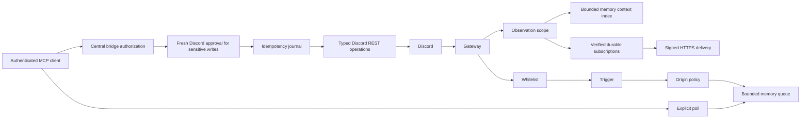

# Architecture and recovery

One Node.js process owns the Discord Gateway client, REST adapter, MCP listener, policy, action queue, context index, subscription/outbox store and journal. Operation modules contain fixed routes and typed Zod schemas; none accept a raw route, method, shell command or code payload.

## Modules

| Location | Responsibility |
| :-- | :-- |
| `src/core/config.ts` | Environment/policy parsing, capability schema, intent prerequisites |
| `src/core/policy.ts`, `triggers.ts` | Exact user whitelist, resource scopes, destination/origin constraints, literal triggers |
| `src/core/queue.ts`, `approvals.ts` | Bounded event retention/dedupe and same-user confirmation |
| `src/core/journal.ts`, `runtime.ts` | Serialized persistent idempotency and one-instance lock |
| `src/core/bridge.ts` | Shared authorization before every mutation and outbound response |
| `src/discord/` | Gateway capture, safe output projection, fixed typed operation families |
| `src/core/context.ts` | Bounded context ingestion/search, separate from action origins |
| `src/core/directory.ts` | Bounded display-name directory, readable mentions and exact name-to-ID resolution; never consulted for authorization |
| `src/events/` | Durable owner/filter/expiry state, verified SSRF-safe HTTPS callbacks, signatures and retry outbox |
| `src/media/` | Bounded upload memory, safe format checks, scoped attachment index/handles, refreshed CDN-only retrieval |
| `src/voice/` | Voice calls: Discord voice link, per-speaker capture, Gemini transcripts, Gemini Live conversations, call context and spoken tasks |
| `src/interactions/` | Typed prompts, single-use actor/message/application bindings, immediate modal launch and child event capture |
| `src/mcp/` | Loopback listener, bearer/OAuth validation and tool registration |
| `scripts/` | Practical offline validation with disposable fixtures |

The bot receives messages and its own `/discordinator` interactions. It checks user IDs before trigger text or reply-reference fetches. A reply must resolve to a message by this bot in the same channel/guild. Accepted message events are captured only on creation. Bot/webhook messages never become triggers or webhook events. Optional context indexing can include bot messages; message edits/deletes update/remove retained context without triggering actions. A slash command is an explicit reference to the application and is gated by its name/application ID, whitelist, origin and messages.write scope before an ephemeral defer. The response closure awaits defer completion, retains the interaction internally and rechecks authorization before editing. No interaction token or raw Discord object is serialized to MCP.

Attachment observation has its own disabled-by-default policy, separate from context and delivery. Metadata never becomes an origin. Media reads require an allowed live event, approved resources in that origin's guild (or its exact DM), and opaque event-bound handles. Uploads remain bounded memory; only fingerprints/outcome IDs enter the send journal. Verified controls add child origins bound to the same actor/channel/guild and actual prompt message. The queue resolves the live parent again; child requests cannot extend authority beyond its lifetime. Button/modal values never enter the approval parser. See [files and controls](media-and-controls.md).

Every mutation resolves a live server-owned event ID, rechecks the user and capabilities, verifies its resource target, and goes through the journal. Replies and content-producing operations stay in the triggering channel; admin actions stay in the triggering guild. DMs can only target the triggering whitelisted author. New reactions and pins additionally require a whitelisted message author or this bot. Deletions/moderation can affect other members after explicit confirmation; they never auto-DM the target. Proactive text sends require a separately approved guild-channel grant and have no arbitrary recipient or actor parameter.

Sensitive operations are marked in their definition. Missing approval returns a preview, not a Discord mutation. Approvals are bounded to 100 outstanding entries and expire after two minutes. Only a new whitelisted, triggered Discord event in the same channel from the same actor confirms one. The approval binds operation name, normalized arguments, original event ID and idempotency key; changed input or another origin is rejected. Successful execution consumes the approval. Nothing exposes a tool to mark approval as confirmed.

Configuration is local. The runtime is event-driven: it watches its settings files for saved changes (such as responder settings and approved people) and reacts to Discord events as they arrive, with no polling loop. `blocklist` server/channel modes are an explicit operator choice. They do not change whitelist/trigger checks, capability grants or approval rules; owner messages follow the same server and channel rules as replies. Message visibility remains governed by Discord channel permissions; requester authorization is not message audience isolation.

## Bounds and failure handling

| Resource | Bound |
| :-- | :-- |
| Event retention | 500 events, ten-minute TTL, at most 4,000 text characters each |
| Event dedupe | 2,000 IDs retained for the same TTL; overload rejects new IDs and increments a counter |
| Context | Defaults 500 records, 50/channel, 30 minutes, 1,000 text characters; policy hard maxima described in [Events and context](mcp-events.md) |
| Webhooks | 100 subscriptions, 500 pending deliveries, ten-minute outbox TTL, six attempts, 256 KiB/body, 8 MiB store |
| Gateway handlers | 32 simultaneous message handlers; overload is counted |
| Polls | 25 events, 20-second wait, eight waiting callers |
| Approvals | 100 entries, two-minute TTL, process-local |
| Journal | 4,096 records, completed-record retention of 24 hours |
| HTTP | 512,000-byte body/output, 16 active dispatches, 32 connections, 120 requests/minute |
| HTTP timeouts | Five-second headers, 30-second request receipt timeout |
| Discord REST | 15-second network timeout, zero automatic 5xx retries |
| Output projection | Allowlisted fields, at most 100 entries per array, 4,000 characters/string, six nesting levels |

discord.js handles Gateway heartbeats/reconnect/resume and Discord REST rate-limit buckets/Retry-After waits. There is no assumption of unlimited API throughput. Rate-limit waits can outlast a client’s call timeout; an HTTP timeout is not proof that a mutation failed. A client disconnect does not undo already-issued work. Partial event loss during disconnection, expiration or overload is possible. The queue reports discarded cursors and dedupe-limit drops instead of implying guaranteed delivery. A DM, permission failure or unsupported resource type can still be refused by Discord.

REST errors are reduced to status/network categories. Startup and Gateway logs are generic, without raw error objects, request bodies, credentials or message content. The bot credential is only used by Discord clients. OAuth access JWTs are validated against configured provider keys; local bearer credentials use constant-time hash comparison. MCP credentials are not forwarded to Discord. See [security](security.md). API output is projected rather than returning raw webhooks, interaction objects, secrets or process environment. User-authored content and invite codes remain potentially sensitive data and are available only to the authenticated operator within approved read scopes; protect the runtime files accordingly.

## Idempotency and recovery

Keys are hashed; normalized tool input is fingerprinted. A pending record is flushed to a private temporary file, atomically renamed into the journal, and recorded before issuing a mutation. Completed results are retained for replay; changed input with the same key is rejected. Mutations are serialized, and the runtime lock prevents concurrent process instances sharing this directory. Text sends also use Discord `nonce`/`enforce_nonce` within Discord’s limited nonce retention window. Poll creation and other writes rely on the journal alone.

Approval/provenance rejection before the request does not establish success. Once an action enters the journal, any exception, interruption or crash can leave a pending/unknown record; that key will not replay automatically. A completed cache remains subject to current origin/scopes, so an expired event or restarted queue cannot be used to bypass authorization. Completed entries expire after 24 hours; this is bounded retry protection, not global exactly-once delivery.

If a call is uncertain:

1. Stop retrying with new keys. Inspect the specific Discord resource and audit history through approved reads or manually.
2. Determine whether the operation happened. Do not infer failure from a timeout or disconnect.
3. If a second attempt is appropriate, obtain a fresh triggering event and fresh approval where needed, then knowingly use a new key.
4. Pending records never age out automatically. If they fill the journal, stop the process and let the owner reconcile/archive resolved records locally before restarting. Preserve unresolved records; do not blindly clear `.data/`.

The journal stores projected outcomes, which can include resource IDs, message content and invite codes. It is ignored by git; use local filesystem protections. POSIX creation modes are restrictive; Windows uses the account’s ACLs. File replacement/flush improves crash recovery but filesystem/power-loss durability is not a distributed transaction with Discord. No multi-host coordination or replication is implemented. Action origins/context remain memory-only; the bounded webhook retry outbox and subscription state are durable. There is no replay/history protocol. See [Events lifecycle](mcp-events.md) for revocation, expiration, cancellation and recovery limits.
